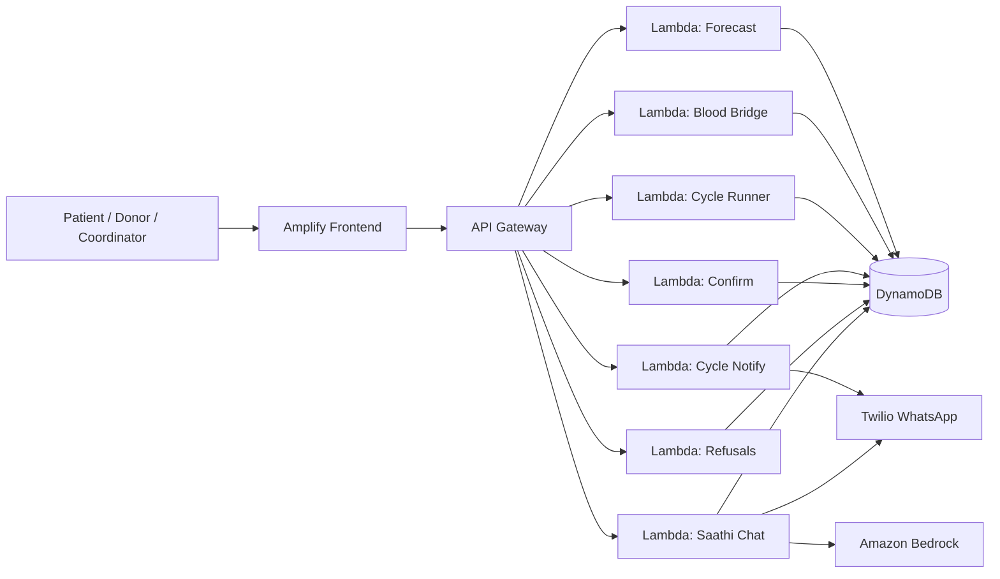
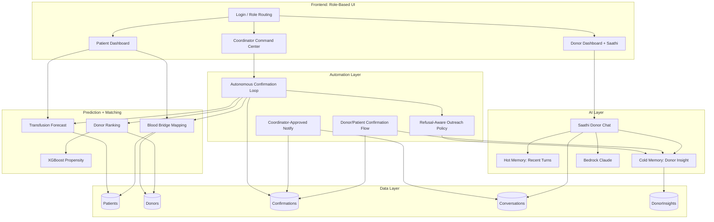
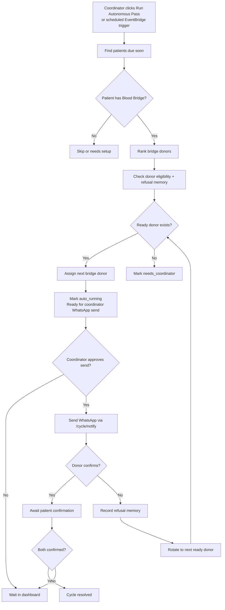
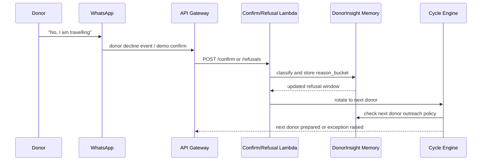
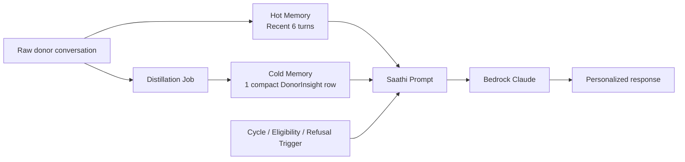

# Marrow: Scalable AI + Automation Architecture

## Hackathon Goal

The goal is not to build a generic hospital CRM. The goal is to show a small,
unique, scalable AI feature that solves a real coordination bottleneck for
thalassemia blood support:

> **Convert reactive manual donor calling into a predictive, memory-aware,
> coordinator-approved automation loop.**

In simple terms, the system should know:

1. which patient will likely need blood soon,
2. which Blood Bridge donor should be asked next,
3. whether that donor should be contacted now or respected because of a prior
   rejection,
4. what message should be prepared,
5. when the coordinator needs to intervene,
6. how confirmations should update the cycle automatically.

This is the scalability story. The coordinator does not manually work every
patient and every donor. The system handles the common path automatically and
surfaces only the exceptions.

---

## What We Implemented

### 1. Role-Based Product Surface

The frontend is now organized around real-world roles instead of a demo-style
user switcher.

- **Patient** sees their next expected transfusion, urgency, and Blood Bridge.
- **Donor** sees Saathi chat, donor memory, and donation impact.
- **Coordinator** sees the automation control center: autonomous cycles,
  exception cycles, donor assignment, WhatsApp send action, and confirmation
  simulation.

This matters because enterprise CRM workflows are role-segregated. A patient
should not manually switch into coordinator mode, and a donor should not see
patient operational controls.

### 2. Forecasting Layer

The backend forecasts upcoming transfusion needs using patient data:

- last transfusion date,
- expected next transfusion date,
- transfusion frequency,
- quantity required,
- blood group,
- urgency window.

The `/forecast` endpoint returns patients who are likely to need blood within a
given window. This is the first automation step: move from “someone calls when
there is a crisis” to “the system knows who is coming due.”

### 3. Blood Bridge Mapping

Blood Bridge is central to Blood Warriors’ real workflow. Instead of searching
all donors every time, each patient is linked to a dedicated bridge/pool of
donors with compatible blood group.

The `/bridge` endpoint returns:

- bridge donors,
- donor readiness,
- rotation state,
- eligibility,
- ranking score,
- ML propensity where available.

This makes the product specific to the problem statement. It is not simply
“find any donor.” It is “keep this patient sustained through a rotating,
respectful donor pool.”

### 4. XGBoost-Inspired Donor Pairing

The ranking layer blends rule-based matching with learned donor propensity:

- blood compatibility,
- eligibility,
- days since last donation,
- responsiveness,
- distance,
- historical donation behavior,
- ML propensity from the pairing model.

The model is served safely with a fallback. If model artifacts are unavailable,
the rule score still works, so the demo does not break.

For the hackathon, the ML feature is useful because it gives us a defensible
story: the system does not randomly pick a donor. It predicts the most likely
available donor while respecting medical and operational constraints.

### 5. Autonomous Confirmation Loop

This is the main automation feature.

The `/cycle/run` endpoint performs a pass across upcoming patients:

1. finds upcoming patient needs,
2. checks whether the patient has a Blood Bridge,
3. ranks the bridge donors,
4. filters donors using eligibility and refusal memory,
5. assigns the next ready donor,
6. creates or updates a confirmation cycle,
7. classifies the cycle as:
   - `auto_running`,
   - `needs_coordinator`,
   - `resolved`.

The important design decision: **cycle creation does not send WhatsApp
automatically.** It prepares the work. The coordinator decides when to send.

That prevents the dangerous behavior where starting the backend immediately
sends all queued donor messages.

### 6. Coordinator-Controlled WhatsApp Send

The `/cycle/notify` endpoint sends a WhatsApp message only for one selected
cycle after the coordinator clicks `send WhatsApp`.

This gives us a safer demo and a better product workflow:

- automation prepares the next best action,
- human approves outreach,
- WhatsApp sends only one selected donor message,
- the cycle records notification status,
- the conversation memory records what was sent.

This design is scalable because the coordinator is no longer composing and
tracking every message manually. They approve the prepared action.

### 7. Donor Refusal Memory

The system now treats donor rejection as useful structured memory, not as a
failure.

When a donor says no, the `/refusals` endpoint or `/confirm` donor-decline path
records:

- reason bucket,
- free-text refusal,
- refusal count,
- cooldown window,
- last refusal date,
- engagement state.

The outreach policy uses this cold memory to decide:

- **CONTACT**: donor can be asked,
- **WAIT**: donor should not be contacted until a future date,
- **SKIP/ESCALATE**: donor requires human handling.

This is the unique AI feature: **the system handles “no” gracefully.** It does
not repeatedly spam donors. It converts rejection into long-term donor
relationship intelligence.

### 8. Saathi Donor Chat + Memory

The donor side includes Saathi, an AI chat layer that uses:

- donor profile,
- recent hot conversation history,
- cold distilled donor insight,
- language/channel preferences,
- donation context.

The memory architecture is intentionally scalable:

- **Hot memory**: recent raw chat turns.
- **Cold memory**: compressed donor insight.

This avoids loading giant chat histories into every AI call. The AI prompt gets
only the useful compact insight, which makes it cheaper and more scalable.

### 9. Patient Dashboard

The patient UI shows:

- next tentative transfusion need,
- Blood Bridge status,
- ready donor count,
- bridge donor cards,
- confidence/urgency signals.

This matters for the demo because patients are not passive records. They can see
that the system is proactively planning their support.

### 10. Donor Gamification

The donor UI includes the idea of a shareable donor impact/placard experience:

- “you helped save a life,”
- donation count,
- personal contribution,
- shareable visual moment.

This supports visibility and growth. It turns donors into advocates, similar to
how Strava makes personal activity socially shareable.

### 11. AWS Deployment

The system is deployed with:

- **Amplify** for frontend,
- **API Gateway** for HTTP routes,
- **Lambda** for backend functions,
- **DynamoDB** for patients, donors, confirmations, conversations, and memory,
- **Bedrock** for AI chat/outreach where configured,
- **Twilio WhatsApp** for donor messaging.

The live frontend is connected to the deployed API Gateway URL.

---

## High-Level Architecture



### What This Shows

The frontend is only the control surface. The scalable work happens in backend
services:

- API Gateway routes requests,
- Lambdas isolate each capability,
- DynamoDB stores operational state,
- Bedrock adds AI reasoning/message generation,
- Twilio handles WhatsApp delivery.

---

## System Architecture by Domain



---

## Autonomous Confirmation Loop



### Why This Scales

Without automation:

- coordinator checks every patient,
- coordinator searches every donor,
- coordinator manually calls donors,
- coordinator remembers who said no,
- coordinator follows up manually,
- coordinator tracks confirmations manually.

With this system:

- forecast finds patients,
- Blood Bridge narrows the donor pool,
- ranking selects the best donor,
- refusal memory prevents bad outreach,
- dashboard shows prepared actions,
- WhatsApp sends approved messages,
- confirmations update state,
- coordinator handles only exceptions.

The coordinator’s work changes from **manual execution** to **supervision**.

---

## Donor Refusal Memory Architecture



### Why This Is the AI Feature

The system does not treat donor refusal as a dead end. It converts refusal into
future behavior:

- “travelling” means wait for a short period,
- “medical” means wait longer,
- “fear/trust issue” means escalate more carefully,
- repeated refusal changes engagement state.

That is a practical AI feature because it reduces donor fatigue and improves
trust.

---

## Hot Memory vs Cold Memory



### Scalability Benefit

If we passed the full chat history into every AI call, cost and latency would
grow as conversations grow. Instead:

- recent chat gives immediate context,
- cold memory gives long-term relationship context,
- prompt size stays small,
- Bedrock cost stays bounded,
- donor personalization still improves over time.

---

## Coordinator Dashboard Flow

```mermaid
flowchart LR
    Coord[Coordinator] --> Run[Run autonomous pass]
    Run --> Auto[Auto-running cycles]
    Run --> Exceptions[Needs coordinator]

    Auto --> Send[Send WhatsApp button]
    Send --> NotifyAPI[/cycle/notify]
    NotifyAPI --> Twilio[WhatsApp donor]

    Exceptions --> Drawer[Open bridge drawer]
    Drawer --> Assign[Assign donor manually]
    Assign --> Auto
```

### Product Meaning

The dashboard proves the core hackathon idea:

- the system can run the first pass by itself,
- the coordinator sees autonomy rate,
- exceptions are separated from normal cases,
- donor messaging is automated but still human-approved,
- manual assignment feeds back into automation.

---

## Data Flow

```mermaid
flowchart TD
    Dataset[Dataset.csv] --> Loader[scripts/load_dataset.py]
    Loader --> Patients[(DynamoDB Patients)]
    Loader --> Donors[(DynamoDB Donors)]

    Patients --> Forecast[/forecast]
    Patients --> Bridge[/bridge]
    Donors --> Bridge
    Donors --> Rank[/rank-donors]

    Forecast --> CycleRun[/cycle/run]
    Bridge --> CycleRun
    Rank --> CycleRun
    CycleRun --> Confirmations[(DynamoDB Confirmations)]

    Confirmations --> Cycles[/cycles]
    Confirmations --> Notify[/cycle/notify]
    Confirmations --> Confirm[/confirm]

    Notify --> Conversations[(DynamoDB Conversations)]
    Confirm --> DonorInsights[(DynamoDB DonorInsights)]
```

---

## How Each User Experiences the System

### Patient

The patient sees that the system is planning ahead:

- next expected transfusion date,
- how soon support is needed,
- Blood Bridge pool,
- ready donors,
- tentative donor coverage.

This reduces uncertainty for families.

### Donor

The donor is treated as a person, not just a phone number:

- Saathi chat understands their context,
- refusal reasons are remembered,
- messaging can respect language/channel/time preferences,
- donor impact is shown through gamification.

This reduces fatigue and improves donor retention.

### Coordinator

The coordinator sees:

- autonomous cycles,
- exception cycles,
- autonomy percentage,
- donor assignment drawer,
- WhatsApp send action,
- confirmation controls.

This reduces workload by moving them from manual execution to exception
management.

---

## Key Implementation Files

| Area | Files | Purpose |
|---|---|---|
| Forecasting | `backend/forecast/handler.py`, `backend/shared/forecasting.py` | Predict upcoming patient need |
| Blood Bridge | `backend/bridge/handler.py`, `backend/shared/ranking.py` | Show/rank patient’s dedicated donor pool |
| XGBoost pairing | `backend/shared/pairing.py`, model artifacts/scripts | Blend learned donor propensity into ranking |
| Cycle automation | `backend/cycle_runner/handler.py`, `backend/shared/cycle_engine.py` | Run autonomous assignment loop |
| Coordinator send | `backend/cycle_notify/handler.py` | Send WhatsApp only after coordinator action |
| Confirmations | `backend/confirm/handler.py`, `backend/shared/confirmations.py` | Track donor/patient confirmation state |
| Refusal memory | `backend/refusals/handler.py`, `backend/shared/memory.py`, `backend/shared/outreach_policy.py` | Convert donor no into future outreach policy |
| AI chat | `backend/saathi_chat/handler.py`, `backend/shared/prompts/*` | Donor chat + message generation |
| WhatsApp | `backend/shared/whatsapp.py` | Twilio integration |
| Frontend API | `frontend/lib/api.ts` | Client methods for live backend |
| Coordinator UI | `frontend/app/coordinator/page.tsx` | Automation command center |
| Patient UI | `frontend/app/patient/page.tsx` | Need forecast + Blood Bridge |
| Donor UI | `frontend/app/donor/page.tsx` | Saathi chat + donor memory/impact |
| Deployment | `scripts/deploy_lambdas.sh`, `scripts/deploy_api_gateway.sh` | AWS Lambda/API Gateway deployment |

---

## Why This Is Small, Unique, and Scalable

### Small

The core feature is narrow:

> For upcoming transfusion cycles, automatically pick the next appropriate
> Blood Bridge donor, respect refusal memory, and prepare coordinator-approved
> WhatsApp outreach.

It is not trying to solve every hospital operation.

### Unique

The differentiator is not just AI chat. The differentiator is **memory-aware
donor automation**:

- remembers why donors said no,
- avoids repeated bad outreach,
- rotates through Blood Bridge donors,
- keeps humans in the approval loop,
- turns donor relationship history into operational decisions.

### Scalable

It scales because:

- DynamoDB handles large patient/donor state,
- Lambdas isolate each workflow,
- cold memory keeps AI prompts small,
- Blood Bridge limits search space,
- XGBoost/ranking avoids random donor selection,
- coordinators handle exceptions instead of all cycles,
- WhatsApp outreach is automated per approved cycle.

---

## Demo Script

1. Open the live frontend.
2. Login as coordinator.
3. Show autonomy dashboard.
4. Click `Run autonomous pass`.
5. Explain that the backend:
   - forecasts upcoming transfusions,
   - checks Blood Bridge,
   - ranks donors,
   - respects refusal memory,
   - prepares cycles.
6. Show `auto_running` cycles.
7. Click `send WhatsApp` for one cycle.
8. Explain that bulk sends are prevented; coordinator controls the outbound
   action.
9. Simulate donor confirmation or decline.
10. If donor declines, show that the system records refusal memory and rotates
    to the next donor.
11. Open patient dashboard to show Blood Bridge visibility.
12. Open donor dashboard to show Saathi/chat/memory/impact.

---

## Current Known Limitation

Twilio sandbox/account quota can block real outbound WhatsApp messages. The
backend path is implemented and deployed, but final live send testing depends on
using a Twilio account with available WhatsApp quota.

The product behavior is still correct:

- `/cycle/run` does not bulk send,
- `/cycle/notify` sends only one coordinator-approved message,
- failure is recorded in cycle state,
- the coordinator can retry or contact manually.

---

## Next Engineering Steps

1. Replace Twilio sandbox credentials with the final account.
2. Test exactly one live `send WhatsApp` click from the coordinator dashboard.
3. Add EventBridge schedule for full daily automation.
4. Improve inbound WhatsApp webhook so real donor replies update `/confirm`
   without demo buttons.
5. Add better coordinator filters: due date, bridge, blood group, state.
6. Add fuller XGBoost training story and show feature importance in the UI.
7. Add final pitch screenshots and demo script.

